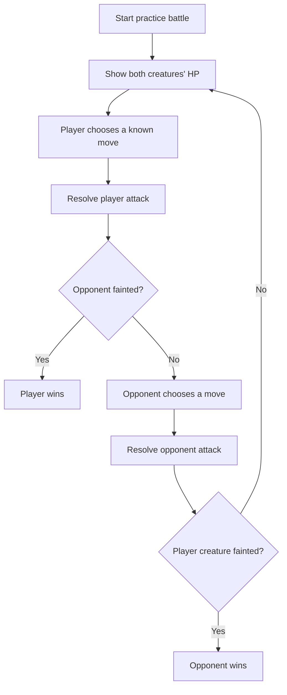
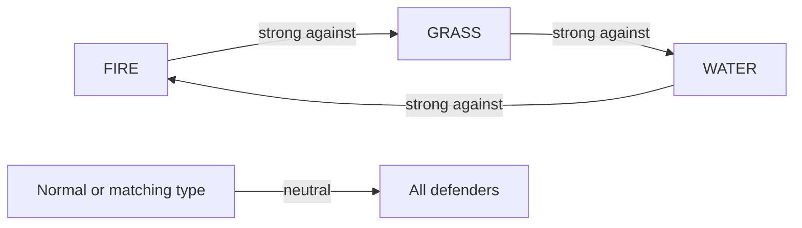
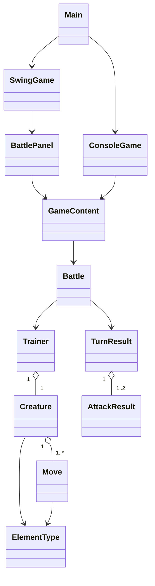

# Poklone

Poklone is an original creature-battling game and Java/OOP learning project.
The current version is a small, playable desktop battle: one creature faces one
opponent, the player chooses moves, elemental effectiveness affects damage, and
the battle ends when one creature faints. A terminal adapter remains available
for debugging and accessibility.

The project is inspired by the creature-battling genre, but it does not use
Pokémon characters, names, world-building, or assets.

## Current status

The first playable vertical slice and desktop adapter are implemented and verified:

- Java 21 and Maven 3.9.16 pinned for this project
- Swing desktop UI with move buttons, health bars, battle log, and restart flow
- Interactive terminal battle with numbered move selection and `q` to quit
- Deterministic `--demo` mode for smoke testing and demonstrations
- Grass, water, fire, and neutral elemental effectiveness
- Player-first attack resolution; the opponent only counterattacks if it survives
- Health, fainting, win/loss state, and invalid-input handling
- Domain rules separated from terminal input/output
- Thirteen passing JUnit tests covering domain contracts, state isolation,
  console output, and GUI wiring

## Gameplay loop



Elemental damage currently follows a compact triangle:



## Architecture

The `domain` package owns battle state and rules. It has no dependency on the
terminal, which leaves room for a future LibGDX, JavaFX, or other presentation
layer without rewriting the battle model.



Responsibilities are intentionally small:

- `Main` launches the desktop UI by default and selects console or demo modes.
- `application.ConsoleGame` handles input, output, and the opponent's move choice.
- `application.GameContent` creates fresh battles and all built-in content.
- `domain.Battle` orchestrates turns and enforces battle rules.
- `domain.Creature`, `Move`, `Trainer`, and `ElementType` model the battle domain.
- `domain.TurnResult` and `AttackResult` expose the events needed by a UI.
- `ui.swing.BattlePanel` renders those events without placing UI dependencies in
  the domain.

## Project structure

```text
.
|-- .mvn/                      Java toolchain and Maven wrapper configuration
|-- mvn.cmd                    Windows launcher pinned to the project JDK
|-- mvnw / mvnw.cmd            Maven 3.9.16 wrapper
|-- run.cmd                    Test and launch helper
|-- pom.xml
|-- README.md
|-- Plan.md                    Historical brainstorming conversation
|-- docs/
|   |-- NEXT_STEPS.md           Sequenced expansion plan
|   `-- PROJECT_PLAN.md         Current milestone, architecture, and roadmap
`-- src/
    |-- main/java/se/poklone/
    |   |-- Main.java
    |   |-- application/
    |   |   |-- ConsoleGame.java
    |   |   `-- GameContent.java
    |   |-- domain/
    |   |   |-- AttackResult.java
    |   |   |-- Battle.java
    |   |   |-- BattleStatus.java
    |   |   |-- Creature.java
    |   |   |-- ElementType.java
    |   |   |-- Move.java
    |   |   |-- Trainer.java
    |   |   `-- TurnResult.java
    |   `-- ui/swing/
    |       |-- BattlePanel.java
    |       `-- SwingGame.java
    `-- test/java/se/poklone/
        |-- application/
        |   |-- ConsoleGameTest.java
        |   `-- GameContentTest.java
        |-- domain/
        |   |-- BattleTest.java
        |   |-- CreatureTest.java
        |   `-- ElementTypeTest.java
        `-- ui/swing/BattlePanelTest.java
```

## Requirements

- Temurin JDK 21.0.12+8 (installed locally under `%USERPROFILE%\.jdks`)
- No global Maven installation is required; the wrapper uses Maven 3.9.16

## Run the game

From the project root in PowerShell:

```powershell
.\run.cmd
```

The desktop UI is the default. To use the original terminal adapter:

```powershell
.\run.cmd --console
```

For a non-interactive smoke test:

```powershell
.\run.cmd --demo
```

Build or run the test suite directly with:

```powershell
.\mvn.cmd clean package
.\mvn.cmd test
```

`run.cmd` launches from `target\classes`, so a running game does not lock the
packaged JAR during development. `mvn.cmd` sets Java only for its child process,
so the machine-wide `JAVA_HOME`
is unchanged. Set `POKLONE_JAVA_HOME` before invoking it only if JDK 21 lives
somewhere other than the default user JDK directory.

## Progression and roadmap

```text
[Complete]  Milestone 1: 1v1 vertical slice and Swing desktop adapter
     |
     v
[Next]      Milestone 2: richer battles
            speed/turn order, stats, status effects, parties, switching,
            experience, levels, and progression
     |
     v
[Later]     Milestone 3: exploration prototype
            tile map, movement, collision, interaction, and battle triggers
     |
     v
[Later]     Milestone 4: content and persistence
            data files, validation, save/load, original art, and audio
```

The next milestone should extend the domain model before a rendering framework
is selected. LibGDX versus another Java presentation framework, target platform,
damage formulas, map format, and asset dimensions remain intentionally deferred
until the exploration milestone needs them.

See [`docs/NEXT_STEPS.md`](docs/NEXT_STEPS.md) for the sequenced implementation
plan and [`docs/PROJECT_PLAN.md`](docs/PROJECT_PLAN.md) for the milestone
definitions, architecture notes, and deferred decisions.

## Verification

The current checkout was verified with:

```text
.\mvn.cmd clean package -> BUILD SUCCESS on Temurin 21.0.12
Tests                   -> 13 passed, 0 failed
java -jar ... --demo   -> completes with "You won the practice battle!"
Desktop UI             -> full battle and restart flow visually verified
```
