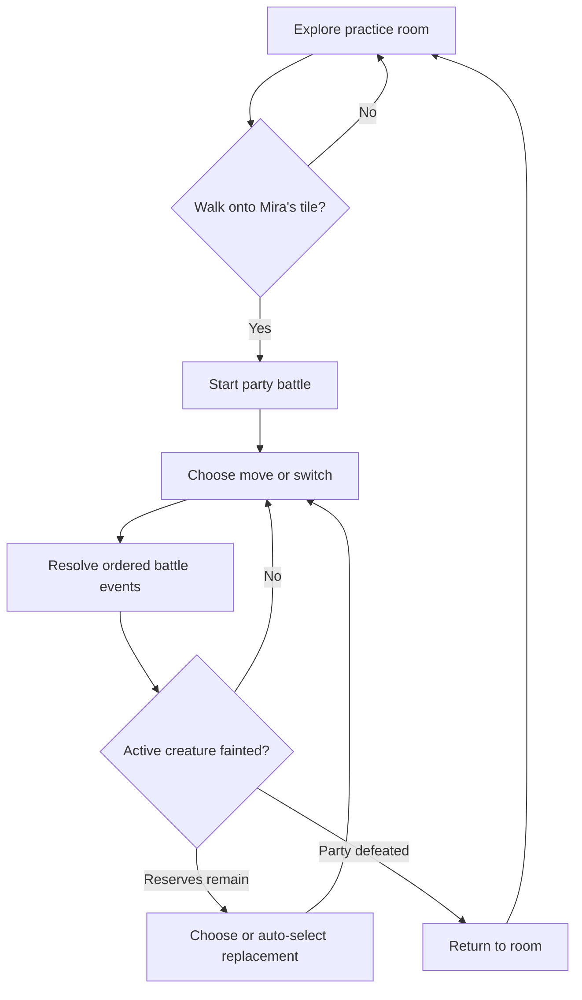
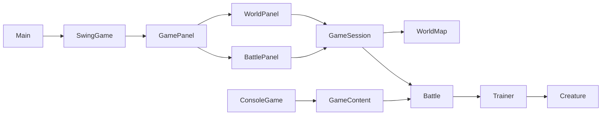

# Poklone

Poklone is an original creature-battling game and Java/OOP learning project.
The current desktop prototype has a small practice room: move through a tile
map, collide with walls, meet Scout Mira, battle with a two-creature party,
then return to the room. A terminal battle adapter remains available for
debugging and accessibility.

The project is inspired by the creature-battling genre, but it does not use
Pokemon characters, names, world-building, or assets.

## Current status

- Java 21 and Maven 3.9.16 pinned for this project
- Swing room UI with WASD/arrow/button movement, walls, and one encounter
- Quiet looping room music plus movement, collision, encounter, battle, and outcome sounds
- Shared `Sound: on/off` control; missing audio devices degrade without stopping the game
- Swing and terminal battles with party selection and voluntary switching
- Forced player replacement and automatic opponent replacement after fainting
- `GameSession` owns the player's persistent party, world position, and
  exploration/battle transitions
- Attack, defence, speed, elemental effectiveness, and speed-based turn order
- Deterministic `--demo` mode for smoke testing
- 35 passing JUnit tests across domain, application, console, and Swing layers

## Gameplay loop



Damage is `max(1, round(power * attack / defence * effectiveness))`. Fire,
water, and grass form a 1.5/0.75 effectiveness triangle; normal and matching
types are neutral. Faster creatures attack first and the player wins speed ties.

## Architecture



- `domain` contains renderer-independent battle and map rules. `Battle` owns
  active party slots; `TurnResult` exposes ordered `BattleEvent` values.
- `application.GameSession` owns cross-screen state and transitions.
  `GameContent` creates fresh built-in creatures, parties, and the practice map.
- `ui.swing.GamePanel` switches between `WorldPanel` and `BattlePanel`.
  Neither UI class decides battle outcomes or collision rules.
- `ui.swing.AudioPlayer` keeps Java Sound playback behind an injectable adapter;
  tests use silent or recording implementations instead of desktop audio hardware.
- `ConsoleGame` is a second adapter over the same battle model.

This Swing world is deliberately a mechanics prototype. It validates movement,
collision, encounters, and screen transitions before committing to LibGDX,
JavaFX, a map editor, or an asset pipeline.

## Placeholder audio

Audio files live under `src/main/resources/audio/` and ship inside the JAR.
Current music comes from Not Jam Music Pack 2; effects come from 8-Bit Sound
Effect Pack Vol. 001. Both are CC0. Exact authors, original filenames, links,
and licenses are recorded in `src/main/resources/audio/LICENSES.md`.

## Run and verify

From the project root in PowerShell:

```powershell
.\run.cmd
.\run.cmd --console
.\run.cmd --demo
.\mvn.cmd test
.\mvn.cmd clean package
```

The desktop UI is the default. `run.cmd` launches from `target\classes`, so a
running game does not lock the packaged JAR. `mvn.cmd` sets Java only for its
child process, leaving the machine-wide `JAVA_HOME` unchanged. Override
`POKLONE_JAVA_HOME` only when JDK 21 is installed somewhere other than the
default `%USERPROFILE%\.jdks` location.

## Project layout

```text
src/main/java/se/poklone/
|-- Main.java
|-- application/        GameContent, GameSession, console adapter
|-- domain/             battle, party, event, stats, and world-map rules
`-- ui/swing/           room, battle, card transition, desktop launcher

src/test/java/se/poklone/
|-- application/        session transitions, content isolation, demo
|-- domain/             battle/party/map contracts
`-- ui/swing/           component-level room and battle flows
```

See [`docs/NEXT_STEPS.md`](docs/NEXT_STEPS.md) for the recommended expansion
order and [`docs/PROJECT_PLAN.md`](docs/PROJECT_PLAN.md) for milestone decisions.

## Verification snapshot

```text
.\mvn.cmd clean test   -> 35 passed, 0 failed on Temurin 21.0.12
.\run.cmd --demo      -> completes with "You won the practice battle!"
```
