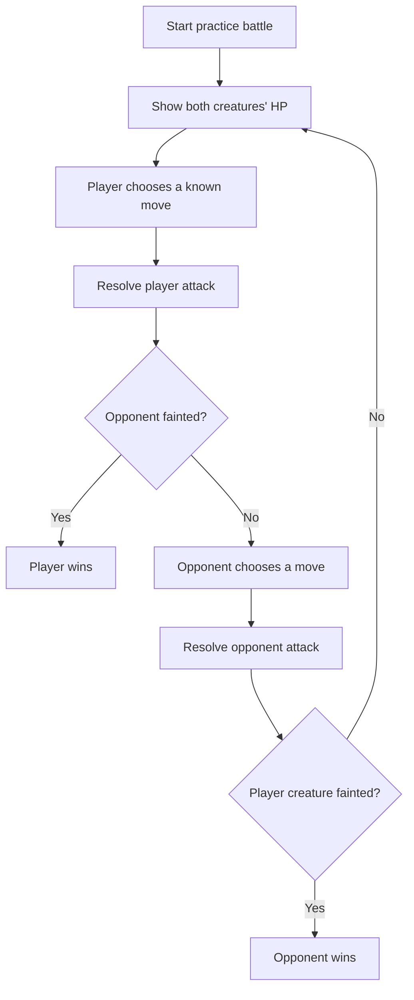
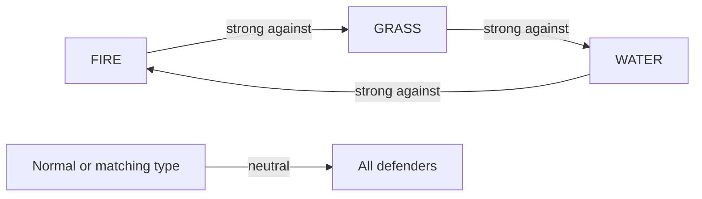
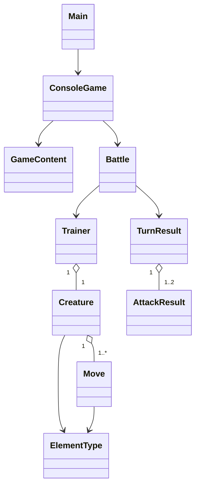

# Poklone

Poklone is an original creature-battling game and Java/OOP learning project.
The current version is a small, playable terminal battle: one creature faces
one opponent, the player chooses moves, elemental effectiveness affects damage,
and the battle ends when one creature faints.

The project is inspired by the creature-battling genre, but it does not use
Pokémon characters, names, world-building, or assets.

## Current status

The first playable vertical slice is implemented and verified:

- Java 21 and Maven project setup
- Interactive terminal battle with numbered move selection and `q` to quit
- Deterministic `--demo` mode for smoke testing and demonstrations
- Grass, water, fire, and neutral elemental effectiveness
- Player-first attack resolution; the opponent only counterattacks if it survives
- Health, fainting, win/loss state, and invalid-input handling
- Domain rules separated from terminal input/output
- Six passing JUnit tests covering battle flow, damage, elemental rules, and demo output

## Gameplay loop



Elemental damage currently follows a compact triangle:



## Architecture

The `domain` package owns battle state and rules. It has no dependency on the
terminal, which leaves room for a future LibGDX, JavaFX, or other presentation
layer without rewriting the battle model.



Responsibilities are intentionally small:

- `Main` selects interactive mode or automated demo mode.
- `application.ConsoleGame` handles input, output, and the opponent's move choice.
- `application.GameContent` creates the starter trainers, creatures, and moves.
- `domain.Battle` orchestrates turns and enforces battle rules.
- `domain.Creature`, `Move`, `Trainer`, and `ElementType` model the battle domain.
- `domain.TurnResult` and `AttackResult` expose the events needed by a UI.

## Project structure

```text
.
|-- pom.xml
|-- README.md
|-- Plan.md                    Historical brainstorming conversation
|-- docs/
|   `-- PROJECT_PLAN.md         Current milestone, architecture, and roadmap
`-- src/
    |-- main/java/se/poklone/
    |   |-- Main.java
    |   |-- application/
    |   |   |-- ConsoleGame.java
    |   |   `-- GameContent.java
    |   `-- domain/
    |       |-- AttackResult.java
    |       |-- Battle.java
    |       |-- BattleStatus.java
    |       |-- Creature.java
    |       |-- ElementType.java
    |       |-- Move.java
    |       |-- Trainer.java
    |       `-- TurnResult.java
    `-- test/java/se/poklone/
        |-- application/ConsoleGameTest.java
        `-- domain/
            |-- BattleTest.java
            |-- CreatureTest.java
            `-- ElementTypeTest.java
```

## Requirements

- JDK 21 or newer
- Maven 3.9 or newer

## Run the game

From the project root in PowerShell:

```powershell
mvn.cmd clean package
java -jar target/Poklone-1.0-SNAPSHOT.jar
```

Choose a numbered move each turn. Enter `q` to leave the game.

For a non-interactive smoke test:

```powershell
java -jar target/Poklone-1.0-SNAPSHOT.jar --demo
```

Run the test suite directly with:

```powershell
mvn.cmd test
```

## Progression and roadmap

```text
[Complete]  Milestone 1: terminal 1v1 vertical slice
     |
     v
[Next]      Milestone 2: richer battles
            speed/turn order, stats, status effects, parties, switching,
            experience, levels, and progression
     |
     v
[Later]     Milestone 3: exploration prototype
            tile map, movement, collision, interaction, and battle triggers
     |
     v
[Later]     Milestone 4: content and persistence
            data files, validation, save/load, original art, and audio
```

The next milestone should extend the domain model before a rendering framework
is selected. LibGDX versus another Java presentation framework, target platform,
damage formulas, map format, and asset dimensions remain intentionally deferred
until the exploration milestone needs them.

See [`docs/PROJECT_PLAN.md`](docs/PROJECT_PLAN.md) for the detailed milestone
definition, architecture notes, and deferred decisions.

## Verification

The current checkout was verified with:

```text
mvn.cmd clean package  -> BUILD SUCCESS
Tests                  -> 6 passed, 0 failed
java -jar ... --demo   -> completes with "You won the practice battle!"
```
