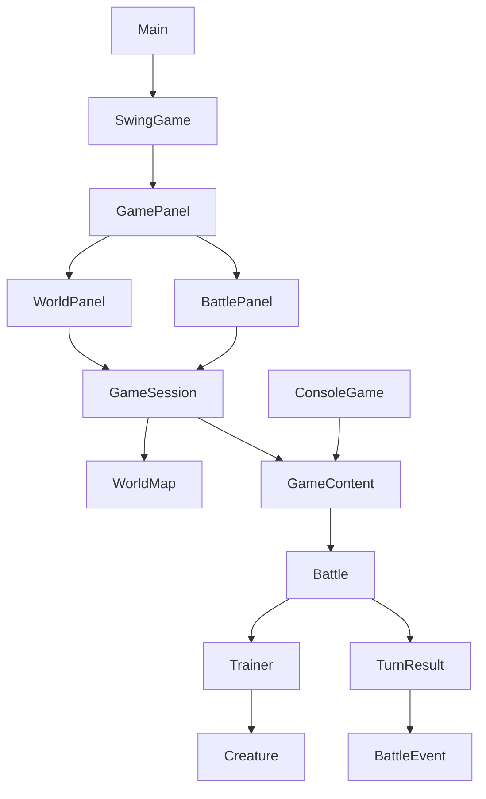

# Poklone project plan

## Product boundary

Poklone is a Java learning project and an original creature battler, not a
reproduction of Pokemon lore or assets. `Plan.md` is historical brainstorming;
this document and `README.md` describe the implemented direction.

The project grows through complete playable slices. Rules and state stay
independent of the presentation layer so a future renderer can replace Swing
without replacing the battle or world model.

## Implemented slices

### Battle foundation

- elemental moves, health, fainting, and deterministic opponent choices;
- attack, defence, speed, stat-scaled damage, and speed order;
- immutable trainer parties with active slots, voluntary switches, forced
  player replacement, and automatic opponent replacement;
- ordered `BattleEvent` results consumed by console and Swing adapters.

### Exploration prototype

- a pure-domain rectangular `WorldMap` with floor, wall, and encounter tiles;
- `GameSession` ownership of party, position, phase, current battle, and
  encounter completion;
- a one-room Swing view with keyboard/button movement and collision;
- room -> battle -> room transition, party recovery, encounter clearing after
  victory, and entrance reset after defeat.

## Architecture

- `domain` contains state and rules only; no Swing, console, files, or framework APIs.
- `application` assembles content and coordinates state spanning screens.
- `ui.swing` renders state and forwards player choices.
- `Main` chooses Swing, interactive console, or deterministic demo mode.

## Next milestone: progression and content identity

1. Give creature and move definitions stable IDs separate from mutable party state.
2. Add level and experience rules plus explicit post-battle progression events.
3. Add one reward after Scout Mira and show it in both adapters.
4. Externalize definitions only after the in-memory identity model is tested.

This comes before a larger world: copying more map rooms now would multiply
hard-coded content and make save data fragile.

## Deferred decisions

- LibGDX, JavaFX, or continued Swing rendering;
- desktop-only versus desktop and Android;
- external content and map formats;
- save-file schema;
- animation, art, audio, and asset dimensions.

Choose these only when a playable slice creates a concrete requirement.
