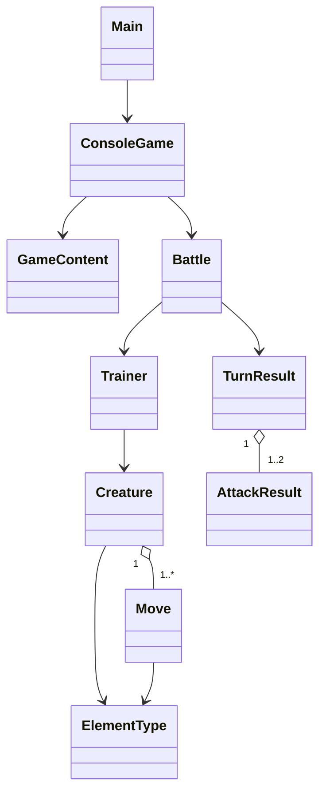

 # Poklone project plan

## What the original plan establishes

`Plan.md` is a brainstorming conversation rather than an actionable
specification. It establishes three useful constraints:

1. The project is a Pokémon-like learning exercise, not a reproduction of
   Pokémon intellectual property.
2. Java is the chosen learning track in this repository. Its existing Maven
   setup is the deciding evidence even though JavaScript was also discussed.
3. Object-oriented battle modeling is the interesting starting point. A
   rendering framework should not be allowed to define the domain model.

## First playable milestone

The first version is a terminal battle with:

- one creature per trainer;
- health, elemental type, and two moves per creature;
- fire, water, grass, and neutral effectiveness;
- player move selection and a computer-selected response;
- win and loss conditions;
- deterministic demo mode and unit tests.

This is intentionally a vertical slice. It produces a complete loop that can
be extended instead of a large set of disconnected placeholder classes.

## Architecture

- `domain` contains rules and state. It has no console or graphics dependency.
- `application` creates fresh battles and adapts console input/output.
- `ui.swing` is a lightweight desktop adapter over `TurnResult` and
  `AttackResult`; it does not own battle rules.
- `Main` chooses the desktop UI, console adapter, or automated demo mode.

The Swing screen is intentionally an adapter prototype, not a decision about
the eventual exploration renderer. It proves that the domain boundary supports
multiple presentations without bringing graphics APIs into `domain`.

## Roadmap

### Milestone 2: richer battles

- speed and turn order;
- attack and defence stats;
- status effects;
- four-to-six moves with move replacement;
- a party of creatures and switching;
- experience, levels, and progression.

Implement this milestone in the order described in
[`NEXT_STEPS.md`](NEXT_STEPS.md), keeping each change playable through both the
desktop and deterministic demo paths.

### Milestone 3: exploration prototype

- choose LibGDX only after the battle model is stable;
- add a tile map, player movement, collision, and one interaction;
- trigger the existing battle system from the map;
- keep rendering adapters outside `domain`.

### Milestone 4: content and persistence

- load original creatures, moves, and encounters from data files;
- validate data at startup;
- add save/load support using plain serializable game-state data;
- introduce original art and audio through a documented asset pipeline.

## Deferred decisions

These should stay open until their milestone needs them:

- LibGDX versus another Java presentation framework;
- desktop-only versus desktop and Android;
- exact stat and damage formulas;
- map editor and data format;
- animation and asset dimensions.

